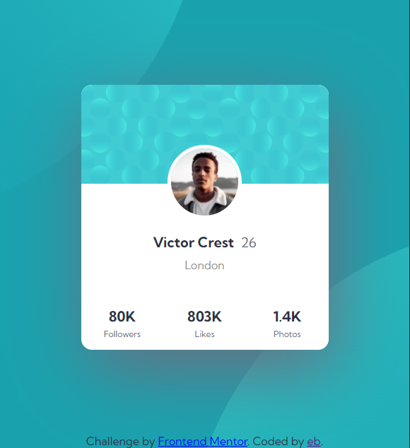

# Frontend Mentor - Profile card component solution

This is a solution to the [Profile card component challenge on Frontend Mentor](https://www.frontendmentor.io/challenges/profile-card-component-cfArpWshJ). Frontend Mentor challenges help you improve your coding skills by building realistic projects. 

## Table of contents

- [Overview](#overview)
  - [The challenge](#the-challenge)
  - [Screenshot](#screenshot)
  - [Links](#links)
- [My process](#my-process)
  - [Built with](#built-with)
  - [What I learned](#what-i-learned)
  - [Continued development](#continued-development)
- [Author](#author)

## Overview

### The challenge

- Build out the project to the designs provided

### Screenshot




### Links

- Solution URL: (https://github.com/enderbone/profile-card-component-main)
- Live Site URL: (https://enderbone.github.io/profile-card-component-main/)

## My process

### Built with

- Semantic HTML5 markup
- Flexbox

### What I learned

I learned a lot about using images in the background. However, I know that my current knowledge is still not enough and I will continue working to improve this part.

```css
body {
    background-color: var(--cor1);
    background-image: url("images/bg-pattern-bottom.svg"), url("images/bg-pattern-top.svg");
    background-repeat: no-repeat, no-repeat;
    background-position: 45vw 50vh, right 50vw bottom 50vh; 
}
```

### Continued development

Want to learn even more about flexbox, and maybe something about grid. Further, want to know more about images in the background, since is a concept that i'm not comfortable yet.

## Author

- Frontend Mentor - [@enderbone](https://www.frontendmentor.io/profile/enderbone)
- Github - [@enderbone](https://github.com/enderbone)
- Twitter - [@anledruis](https://www.twitter.com/anledruis)
